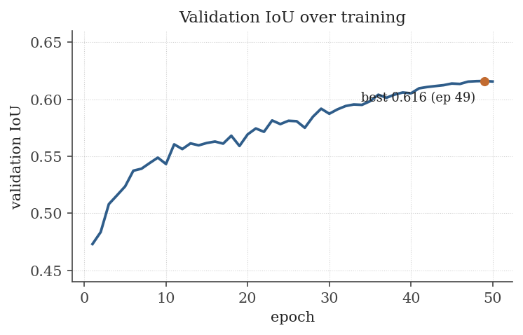

# Curvature-Aware Lane Segmentation for Downstream Control

Lane perception from monocular RGB, optimized against **downstream control error on
high-curvature trajectories** rather than raw segmentation overlap. The end consumer is a
kinematic Model Predictive Controller, so every design choice in this repository is
judged by its effect on the geometry the controller actually consumes: the lateral offset
of the vehicle in its lane and the curvature of the lane ahead.

*Baseline U-Net/ResNet-18 (0.616 val IoU) run frame by frame on held-out TuSimple clips,
a different camera than the CurveLanes training data. Predicted lane mask in red. The
prediction stays stable across frames with no temporal modelling.*

## Data and training

Training uses a curvature-stratified subset of CurveLanes rather than the raw split.
Overlap metrics averaged over the natural distribution are insensitive to the frames the
controller cares most about, which are the tight curves. Per-frame curvature is the 90th
percentile of |κ| along each annotated lane, normalized by image width and reduced to the
maximum over lanes. Frames are binned on this value with fixed, percentile-derived edges
and sampled to an equal count per bin.

Figure 1 shows the effect. CurveLanes is already a curve-curated dataset, so after
excluding odd-aspect frames the image-space curvature concentrates in the middle bins,
and the near-straight and tightest bins each hold about five percent of the data by
construction of the percentile edges. Drawing 1,600 frames per bin (8,000 total) flattens
the distribution and leaves the two extreme bins roughly four times over-represented
relative to their natural frequency.

*Figure 1. Natural vs. stratified training distribution over curvature bins (log scale).
The subset is flat by construction, so the tails are lifted relative to nature.*

The model is a U-Net with an ImageNet-pretrained ResNet-18 encoder (14.3 M parameters).
It trains on 512×288 crops with an equal-weight Dice + BCE objective, Adam at 1e-3 on a
cosine schedule, batch size 8, mixed precision. Preprocessing applies an aspect-preserving
sky crop followed by an isotropic resize, so the resize does not distort curvature and the
stratification label stays valid. Validation runs on a separately stratified 2,000-frame
set. On a 6 GB RTX 3060 an epoch takes about 2.5 minutes and uses 2.4 GB, well under the
memory budget. That headroom matters for the capacity experiment below.

Validation IoU (Figure 2) climbs quickly and plateaus around epoch 40. The best
checkpoint is epoch 48 at 0.616. The early kink is a resume after a power interruption,
not a property of the schedule.

*Figure 2. Foreground IoU on the validation set across 50 epochs.*

## Accuracy across curvature

The best checkpoint reaches 0.616 IoU and 0.762 Dice on the lane class. Background is
excluded as uninformative. Broken out by bin:

| | overall | near-straight | gentle | moderate | sharp | tightest |
|---|---|---|---|---|---|---|
| IoU  | 0.616 | 0.588 | 0.620 | 0.634 | 0.620 | 0.630 |
| Dice | 0.762 | 0.740 | 0.766 | 0.776 | 0.765 | 0.773 |

Accuracy does not fall off with curvature. The near-straight bin is the weakest and the
curved bins are marginally better (Figure 3). This is the stratified sampling working as
intended: with the tight-curve regime lifted to equal weight during training, the model
does not treat it as a rare corner case. The near-straight bin lags for a geometric
reason, not a modelling one. A near-straight lane runs thin all the way to the vanishing
point and carries few foreground pixels, so with a 5-pixel annotation stroke the IoU
denominator is small and boundary error dominates the ratio. A single global IoU would
have hidden this, which is the argument for stratifying the metric.

*Figure 3. Per-bin IoU on the held-in validation set and on a held-out split. The dashed
line is the overall validation IoU. The tightest bin was not sampled in the
natural-distribution held-out draw (n=0).*

## Generalization

To confirm these numbers are not an artifact of the validation set, we evaluated on 250
frames from the CurveLanes `valid` split that belong to neither the training subset nor
the validation subset. They are unseen by both training and checkpoint selection. Overall
IoU there is 0.640, slightly above the validation figure, so the model is not overfit.
The per-bin pattern holds (Figure 3, orange). The tightest bin is empty in this draw
because the sample follows the natural distribution, where such frames are rare. That gap
is itself the reason stratified training was necessary, even when stratified evaluation
cannot populate every bin.

## What does not improve it

We tried the obvious levers for a stronger baseline. None beat 0.616, and the pattern of
failure is the useful result.

Sweeping the decision threshold from 0.30 to 0.80 leaves IoU flat, with a peak at exactly
0.50. The probability maps are already well calibrated, so thresholding gives nothing.
Doubling encoder capacity to ResNet-34, with a larger batch and a Dice-weighted loss,
plateaus at 0.611, just below ResNet-18. Capacity is not the constraint, which matches
the memory headroom above. A Lovász-hinge term, which is a direct IoU surrogate,
destabilizes training from scratch and mildly degrades the model as a low-weight
fine-tune. The one change that helps is horizontal-flip test-time augmentation, which
lifts validation IoU to 0.623. Lanes are left/right symmetric, so the averaged prediction
is slightly cleaner at no training cost.

The model is at the practical ceiling for this supervision. The binding constraint is the
thin-stroke geometry: a one-pixel error on a five-pixel mask is a large relative IoU
penalty, and neither extra capacity nor loss engineering changes that. Moving past about
0.62 requires changing what the network predicts, for example thicker or distance-weighted
supervision, or a bird's-eye-view projection so that far lanes are not compressed into a
few pixels. A bigger backbone is not the answer.

## Qualitative behaviour

The rendered overlays in `results/baseline/`, and the held-out driving montage in
`results/tusimple_demo/`, agree with the numbers. The best frames, around 0.85 IoU, span
the full curvature range, and so do the worst frames. Success and failure are not sorted
by curvature. Where the model fails it is almost always a night scene or faint markings:
it recovers the lane location but lays down a slightly thick, broken stroke. The failure
axis is illumination, not geometry, which is what the flat per-bin table predicts.

## Roadmap toward the controller

The segmenter produces a lane mask in the image plane. The controller needs lateral
offset and preview curvature in metric ground coordinates. The steps between them, in
order:

1. **Centerline extraction.** Reduce the binary mask to ordered lane points and a drivable
   centerline (skeletonize or column-wise peak-picking, then associate points into lanes).
   This turns pixels into the polylines the geometry module already expects.
2. **Ground-plane projection (IPM).** Apply an inverse-perspective homography from camera
   calibration to map lane points into a metric bird's-eye view. This removes the
   perspective inflation of curvature near the vanishing point, which is the known
   limitation of image-space κ noted in `docs/geometry_port_spec.md`.
3. **Geometry in BEV.** Fit the arclength spline in ground coordinates and read off
   curvature κ(s) and lateral offset. The estimator already exists in `src/geometry/`,
   with a portable NumPy reference and a validated C++ port in `deploy/` against shared
   golden vectors.
4. **Control-relevant evaluation.** Replace, or at least augment, IoU with the errors the
   MPC consumes: lateral offset error and curvature error at fixed preview distances. This
   makes the top-line thesis measurable, since a model can win on IoU and still misplace
   the centerline the controller tracks.
5. **Temporal stability.** Track the centerline across frames (a simple state filter on the
   spline coefficients) so the control input is smooth rather than re-estimated
   independently per frame.
6. **Kinematic MPC.** Feed lateral offset, heading error, and previewed κ into a kinematic
   bicycle MPC. Close the loop in simulation first, then port the perception-to-geometry
   path to the C++ target in `deploy/`.

Steps 2 and 3 are the immediate next work. Step 4 is being done in parallel, because it
defines the metric the rest of the project optimizes against.