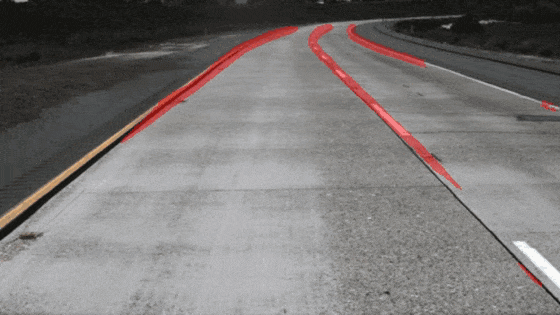
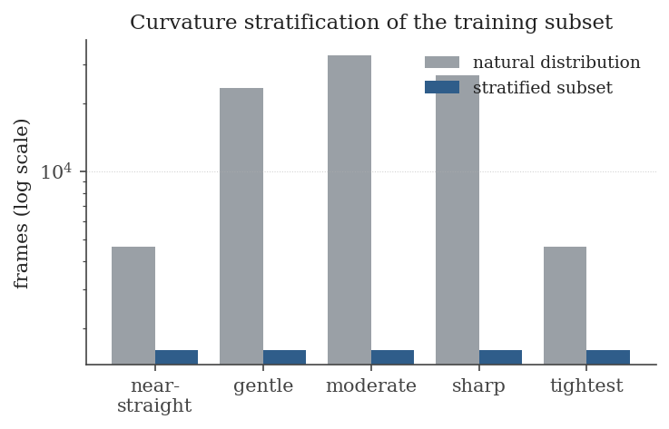
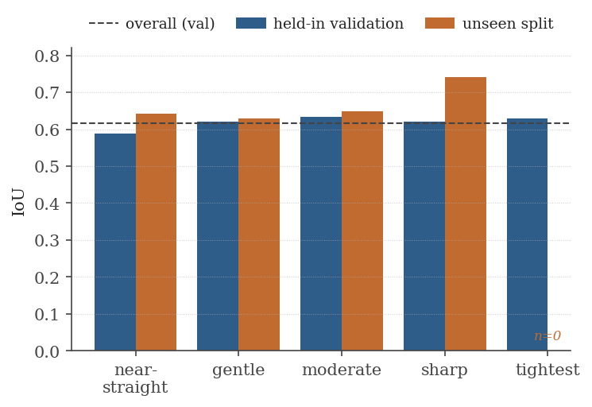
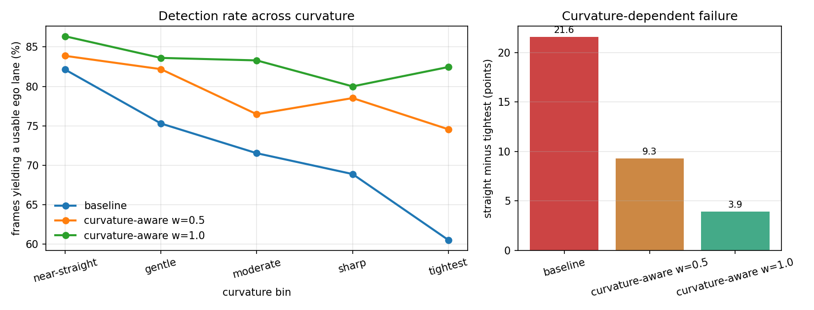
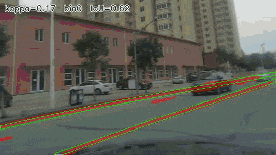
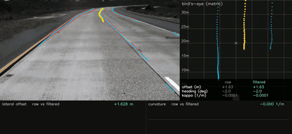
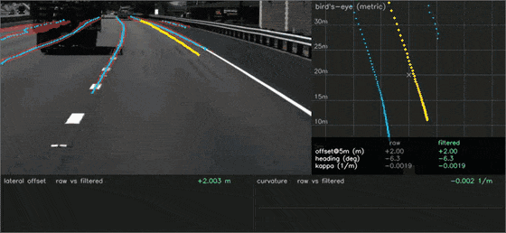

# Curvature-Aware Lane Segmentation for Control

Monocular lane perception evaluated on the geometry a controller consumes, rather than on
segmentation overlap. The intended consumer is a kinematic Model Predictive Controller,
which needs the vehicle's lateral offset in its lane and the curvature of the lane ahead,
so those are the quantities measured here.

  

<em>Baseline U-Net/ResNet-18 (0.616 val IoU) run frame by frame on held-out
TuSimple clips, a different camera than the CurveLanes training data. Predicted lane mask
in red. The prediction stays stable across frames with no temporal modelling.</em>

## Data and training

Training uses a curvature-stratified subset of CurveLanes rather than the raw split.
Overlap metrics averaged over the natural distribution are insensitive to the frames the
controller cares most about, which are the tight curves. Per-frame curvature is the 90th
percentile of |κ| along each annotated lane, normalized by image width and reduced to the
maximum over lanes. Frames are binned on this value with fixed, percentile-derived edges
and sampled to an equal count per bin.

Figure 1 shows the effect. CurveLanes is already a curve-curated dataset, so after
excluding odd-aspect frames the image-space curvature concentrates in the middle bins,
and the near-straight and tightest bins each hold about five percent of the data by
construction of the percentile edges. Drawing 1,600 frames per bin (8,000 total) flattens
the distribution and leaves the two extreme bins roughly four times over-represented
relative to their natural frequency.

*Figure 1. Natural vs. stratified training distribution over curvature bins (log scale).
The subset is flat by construction, so the tails are lifted relative to nature.*

The model is a U-Net with an ImageNet-pretrained ResNet-18 encoder, trained on 512×288
crops with a Dice + BCE objective, which a later section makes curvature-aware.
Preprocessing applies an aspect-preserving sky crop followed by an isotropic resize, so the
resize does not distort curvature and the stratification label stays valid. Validation runs
on a separately stratified 2,000-frame set.

## Accuracy across curvature

The best checkpoint reaches 0.616 IoU and 0.762 Dice on the lane class. Background is
excluded as uninformative. Broken out by bin:

| | overall | near-straight | gentle | moderate | sharp | tightest |
|---|---|---|---|---|---|---|
| IoU  | 0.616 | 0.588 | 0.620 | 0.634 | 0.620 | 0.630 |
| Dice | 0.762 | 0.740 | 0.766 | 0.776 | 0.765 | 0.773 |

Accuracy does not fall off with curvature. The near-straight bin is the weakest and the
curved bins are marginally better (Figure 2). This is the stratified sampling working as
intended: with the tight-curve regime lifted to equal weight during training, the model
does not treat it as a rare corner case. The near-straight bin lags for a geometric
reason, not a modelling one. A near-straight lane runs thin all the way to the vanishing
point and carries few foreground pixels, so with a 5-pixel annotation stroke the IoU
denominator is small and boundary error dominates the ratio. A single global IoU would
have hidden this, which is the argument for stratifying the metric.

*Figure 2. Per-bin IoU on the held-in validation set and on a held-out split. The dashed
line is the overall validation IoU. The tightest bin was not sampled in the
natural-distribution held-out draw (n=0).*

## Generalization

To confirm these numbers are not an artifact of the validation set, we evaluated on 250
frames from the CurveLanes `valid` split that belong to neither the training subset nor
the validation subset. They are unseen by both training and checkpoint selection. Overall
IoU there is 0.640, slightly above the validation figure, so the model is not overfit.
The per-bin pattern holds (Figure 2, orange). The tightest bin is empty in this draw
because the sample follows the natural distribution, where such frames are rare. That gap
is itself the reason stratified training was necessary, even when stratified evaluation
cannot populate every bin.

### Across cameras, not just across splits

The stronger test is a different camera on a different continent. The clip below is a KITTI
drive on a German rural road: shaded, narrow, with a dashed centre line and a solid edge
line rather than the wide highway markings the model trained on. Nothing about it was seen
in training, and no fine-tuning was done.

  

<em>Nine continuous seconds at 10 Hz on KITTI drive 2011_09_26_0027,
every frame yielding an ego lane. The bird's-eye panel uses KITTI's own camera parameters,
not the TuSimple calibration used elsewhere in this README.</em>

The chain recovers an ego lane on **178 of 188 frames (94.7%)** across the whole drive,
which is close to what it manages on TuSimple and far better than its 73.5% on the
CurveLanes validation split. That ordering is not a contradiction: the CurveLanes split is
deliberately curvature-flattened, so it is dominated by the tight curves the model is worst
at, while both video sequences are ordinary driving.

The metric panel is worth a note, because it started out wrong. Applying the TuSimple
calibration to KITTI produced a confident and meaningless picture, with the whole road
collapsed into a wedge around 12 m. KITTI ships its camera parameters, so the intrinsics
were mapped through the same crop-and-resize chain the images take, giving fx=789, cx=245,
cy=67 at 512x288. Pitch was then fitted by the lane-parallelism routine used for TuSimple,
returning **-0.38 degrees** rather than the zero that a rectified camera invites you to
assume. The check that it is right is the same one used throughout: the recovered
boundaries run parallel from 8 m to 32 m, at a separation of **2.75 m**, which is the
standard width of a German *Landstrasse* lane.

Two things remain approximate. Lane width still drifts about 4% between 8 m and 30 m, so
the flat-ground assumption is imperfect on a road that visibly undulates. And the camera
height that comes out, 1.567 m against KITTI's specified 1.65 m, is absorbing the assumed
lane width: height and width are degenerate, as the calibration section below explains, so
one of them has to be asserted.

## Control-relevant error, and why IoU was misleading

Overlap is not the quantity the controller consumes. To measure what is, the mask is
reduced to an ego centreline, projected to a flat ground plane, and fitted, and the same
pipeline is run on the ground-truth mask; the two geometries are then compared in
control units. Reported below over the full validation split (1,767 frames, of which
1,280 yielded a reference geometry and a prediction), stratified by the same curvature
bins.

Offset is reported 5 m ahead rather than at the vehicle, because nothing is observed at
the vehicle plane: the recovered centreline typically begins about 12 m out, so a figure
quoted at the bumper is extrapolated rather than measured. Offset and heading both come
from a least-squares line fitted over the near 12 m.

| bin | detection rate | offset MAE at 5 m | heading MAE | κ MAE at 5 m | at 10 m | at 20 m |
|---|---|---|---|---|---|---|
| near-straight | 82.1% | 1.507 | 4.04° | 0.186 | 0.066 | 0.034 |
| gentle | 75.3% | 1.065 | 3.32° | 0.181 | 0.101 | 0.034 |
| moderate | 71.5% | 0.667 | 3.45° | 0.320 | 0.103 | 0.024 |
| sharp | 68.9% | 0.716 | 4.07° | 0.351 | 0.101 | 0.038 |
| tightest | 60.5% | 0.429 | 3.86° | 0.544 | 0.088 | 0.029 |
| **overall** | **73.5%** | **0.976** | **3.72°** | **0.268** | **0.091** | **0.032** |

Offsets are in metres and curvatures in 1/m under the placeholder ground-plane mapping,
so the absolute scale is provisional; the comparison across bins is the meaningful
reading, and the next section establishes which of these columns survive that caveat.

Two of these columns reverse the conclusion drawn from IoU. **Detection rate falls
monotonically with curvature**, from 82% on near-straight frames to 61% on the tightest
ones: on the curves this project exists for, the model fails to yield a usable ego lane
two times in five. **Near-field curvature error degrades** over the same range, from 0.186
to 0.544, a factor of 2.9. Neither is visible in the per-bin IoU table, where the curved
bins scored slightly *better* than the straight ones. The reason is that IoU counts pixels,
and the pixels are dominated by the wide, unambiguous lane markings near the bumper,
whereas the controller depends on the geometry further ahead and on the lane being found
at all.

Heading error does **not** support that conclusion, and an earlier version of this table
claimed it did. Reading offset and heading from two points instead of a fitted line put
heading MAE at 8.25° in the sharp bin against 5.05° near-straight, which looked like
curvature-dependent degradation. Two points define a line exactly, so their noise passes
through undamped. Fitting the near span drops overall heading error from 5.63° to 3.72° and
flattens it across bins to between 3.32° and 4.07°, leaving no curvature trend. The
apparent trend was an estimator artifact.

One column remains unexplained: offset error *improves* with curvature, from 1.51 m to
0.43 m. It survives both the estimator fix and both ground mappings, so it is not either of
those. Ambiguous ego-lane selection on wide, near-parallel markings pairing the wrong two
boundaries is the remaining candidate. Nothing is claimed from that column.

The practical conclusion is that another point of IoU was the wrong thing to chase.
Detection reliability on curves is what limits this model as a control front end. The next
section acts on that: the objective is made curvature-aware and the failure this section
measures is largely removed.

## Curvature-aware objective

The finding above is that detection fails where the road bends. Until this point the
model had no way to act on it: the loss took a mask and logits, and the only consumer of
a frame's curvature was the validation metric. The project stratified its *data* and its
*metrics* by curvature and left its *objective* blind to it, which is a fair reading of
why the name overpromised.

Two mechanisms close that gap, both off by default so the baseline stays reproducible.
**Per-sample curvature weighting** multiplies a frame's loss by `1 + w·b/(K-1)` for
curvature bin `b` of `K`, so the sharpest bin counts `(1+w)` times the straightest;
stratified sampling had equalized how *often* a curved frame is seen, not how much it
contributes once seen. An **auxiliary head** regresses the frame's curvature from the
encoder bottleneck, which does not change what the segmenter outputs but forces the
representation to carry curvature at all.

Weighting is by bin rather than by raw curvature because the per-bin median curvature on
the training subset runs 0.73, 2.00, 6.27, 21.08, 53.39: a seventy-fold range with a long
tail, on which any weight linear in curvature becomes a step function handing most of the
batch gradient to whichever frame is sharpest. Weights are mean-normalized within each
batch, so enabling them does not also change the effective learning rate.

*Figure 3. Detection rate per curvature bin, and the straight-to-tightest gap, for three
weighting strengths. Same 1,768 validation frames throughout.*

| run | val IoU | tightest bin | overall | straight − tightest | TuSimple (unseen camera) |
|---|---|---|---|---|---|
| baseline | **0.6161** | 60.5% | 73.5% | +21.6 | **95.3%** |
| w=0.5, aux 0.1 | 0.6031 | 74.6% | 79.9% | +9.3 | 75.3% |
| w=1.0, aux 0.1 | 0.6008 | **82.5%** | **83.3%** | **+3.9** | 88.2% |
| w=1.0, no aux | 0.6070 | 73.7% | 78.1% | +11.4 | 85.0% |

**In-domain the objective does what it was designed to do.** Detection improves in every
bin, monotonically with weighting strength, and the curvature-dependent failure the
project was built around collapses from a 21.6-point gap to 3.9. On the tightest bin it
goes 60.5% to 82.5%, which is 172 frames that previously yielded no usable ego lane at
all. The overall gain is 7.1 standard errors on a fixed frame set, and the *shape* of it
matches the intervention: the gain grows with curvature, from +4.2 points on near-straight
frames to +21.9 on the tightest, where a generically better model would have lifted every
bin alike.

It is not bought by predicting more lane. The weighted model emits slightly *fewer*
foreground pixels than the baseline (0.999 against 1.007 of the ground-truth volume) at
marginally lower pixel precision and recall, and still recovers a usable ego lane far more
often. The mask is arranged better along the lane rather than being larger, which is this
project's thesis stated as an experiment: overlap and usable geometry are different
quantities, and a little of the first buys a lot of the second.

**Out of domain it costs.** On 600 frames of TuSimple, a camera the model never trained
on, every weighted variant loses ground against the baseline's 95.3%. The ablation was
run expecting the auxiliary head to be responsible; it is not. Removing the head made both
axes worse, so the head contributes about five points of the in-domain gain and the
out-of-domain cost belongs to the curvature weighting itself. Weighting frames by their
curvature specializes the model to one dataset's mix of curves, and that mix is a property
of CurveLanes rather than of driving.

**A geometric weighting was tried and is worse.** If the cost comes from specializing to
one dataset's curve mix, then weighting *pixels by image row* rather than *frames by
curvature* should avoid it: the far field is where the controller needs geometry and where
the lane is lost, and that argument makes no reference to how many curves the training set
contains. It did not survive contact. Far-field weighting reached 78.2% in-domain, below
every curvature-weighted variant, and 72.0% on TuSimple, the worst of any run.

What that failure exposed is the actual mechanism. Out-of-domain detection tracks how much
foreground a model emits, not how it was weighted: 5174 lane pixels per frame for the
baseline at 95.3%, 4766 at 88.2%, 3819 at 85.0%, 3589 at 72.0%. Every weighted objective
makes the model more conservative, and out of domain a thinner mask fragments into
boundaries that no longer pair into a lane.

That reframes the cost as **calibration rather than capability**, which is testable without
retraining anything. Sweeping the decision threshold on TuSimple, the baseline is best at
the default 0.5 and degrades monotonically below it, while the curvature-aware model peaks
at 0.4:

| threshold | 0.5 | 0.4 | 0.3 | 0.25 | 0.2 |
|---|---|---|---|---|---|
| baseline | **95.3%** | 94.8 | 93.2 | 91.2 | 89.5 |
| curvature-aware | 88.2 | **93.3%** | 88.5 | 87.0 | 85.5 |

Recalibrating recovers 5.1 of the 7.1 lost points. It costs some of the in-domain gain, so
the model offers a trade the baseline cannot reach at any threshold — the baseline is worse
in-domain at 0.4 (68.0%) than at 0.5 (73.5%), so 0.5 really is its best operating point:

| operating point | in-domain detection | TuSimple |
|---|---|---|
| baseline @ 0.5 | 73.5% | 95.3% |
| curvature-aware @ 0.5 | **83.3%** (+9.8) | 88.2% (−7.1) |
| curvature-aware @ 0.4 | 80.2% (+6.7) | 93.3% (−2.0) |

The general lesson is worth more than the numbers: comparing two models at one fixed
threshold conflates what they can do with where they sit on their own operating curve. Most
of what looked like a robustness failure was the second thing.

Three caveats, since the table invites over-reading. Each configuration is a single run at
one seed, so the in-domain ordering is supported by a dose-response across three strengths
but the out-of-domain magnitudes are not ordered by strength at all and are plainly noisy;
only their sign is consistent. IoU falls in every variant, which on a segmentation
leaderboard reads as a regression and is exactly the point. And 83% detection is better,
not good: roughly one frame in six still yields no usable ego lane, which for a controller
is a hand-back every few seconds. What changed is the *shape* of the failure, from
concentrated on the curves that matter to spread evenly, which is the healthier of the two.

## Metric calibration, and what the numbers can support

The table above uses a hand-chosen trapezoid asserted to be a rectangle on flat ground.
That is stable but it is not a camera, so it was replaced with a pinhole model, where the
ground plane maps to the image by `H = K R M` with `M = [[1,0,0],[0,0,h],[0,1,0]]`. On
synthetic scenes the model recovers a known pitch to 0.05 degrees and a projected arc of
radius 80 m to 1e-4.

Its parameters cannot be fitted to CurveLanes. The vanishing point is unusable because the
annotations stop around row 146 while the horizon sits near row 82, leaving a long
extrapolation that scatters by about 68 pixels. Fitting pitch by lane parallelism instead
also fails to identify anything: no interior optimum, 63 percent of frames pegged at the
search bound, and no pitch admitting a plausible camera height. The cause is that
CurveLanes aggregates many vehicles and cameras, so no single calibration exists.

TuSimple does have one, being a single fleet with lanes annotated across the horizon
region. Every failed diagnostic passes there:

| | CurveLanes | TuSimple |
|---|---|---|
| parallelism optimum | at search bound | interior, 7.6 degrees |
| parallelism residual | 0.180 | **0.0139** |
| vanishing point vertical IQR | 68 px | **11 px** |
| recovered lane width | 3.43 m, IQR 2.60 to 4.70 | **3.64 m, IQR 3.56 to 3.80** |
| implied camera height | 2.37 m at zero pitch | **1.62 m** |

The fitted camera is 7.47 degrees of pitch, 1.00 degree of yaw and 1.62 m of height. Two
independent estimators agree on it: parallelism gives 7.47 degrees, and the vanishing
point, which the fit never uses, gives 7.71 degrees. The height suits TuSimple being
trucking footage.

Two caveats. This is TuSimple's camera, so it makes the driving demo metric but leaves the
CurveLanes error magnitudes as relative comparisons; `scripts.eval_control` warns on
cross-dataset use. And re-running the evaluation under the pinhole mapping leaves detection
rates **bit-for-bit identical** while error magnitudes shift three to four fold, so the
headline finding does not depend on calibration but the absolute magnitudes do.

## Qualitative behaviour

  

<em>Validation frames ordered by curvature, near-straight first and
tightest last. Red is the prediction, green the ground-truth contour, and the caption gives
each frame's curvature, bin and IoU. Unlike the demos above this is CurveLanes with labels,
so prediction and truth can be compared directly.</em>

The overlays agree with the numbers. The best frames, around 0.85 IoU, span the full
curvature range, and so do the worst frames. Success and failure are not sorted by
curvature. Where the model fails it is almost always a night scene or faint markings: it
recovers the lane location but lays down a slightly thick, broken stroke. The failure axis
is illumination, not geometry, which is what the flat per-bin table predicts.

Watching the sweep also shows what the per-bin IoU could not. The prediction stays glued to
the ground truth across the whole curvature range, which is exactly why IoU looked flat,
while the frames where the model picks up a barrier or a kerb alongside the real markings
are the ones that later cost an ego-lane detection.

## Control chain

  

<em>Top left: predicted lane mask (red), the tracked boundaries of the ego
lane (cyan), and the centreline between them (yellow), each marked at its sampled points
rather than drawn as a solid stroke, since a finite set of samples is what the estimate
actually is; components outside the ego lane are left to the mask rather than traced, since
they carry nothing the mask does not already show. Top right: the same geometry after the calibrated ground projection, on a metric grid,
with the quantities the controller consumes; crosses mark the 5, 10 and 20 m preview
distances. Bottom: raw per-frame estimates in grey against the temporally filtered signal in
green. Three seconds of continuous held-out TuSimple footage at 20 Hz; the centreline moves
1.2 px per frame at a fixed image row, and four frames report no ego lane rather than one
the tracker could not stand behind. The clip is the strongest unbroken stretch in the longest consecutive run
available in the split, chosen deliberately: it shows the chain working, not its average
case, which the tables below give instead.</em>

This is the whole chain in one view: mask, then polylines, then centreline, then metric
ground geometry, then the three control inputs. It also serves as a visual check on the
calibration, because the lane boundaries come back close to vertical and evenly spaced in
the bird's-eye panel. Perspective makes them converge sharply in the camera view, so
recovering them as parallel is the property a correct inverse-perspective map has to
satisfy, and it is the same property the fit was scored on.

The readout is the interface to the controller. Lateral offset is signed positive to the
right of the camera axis, heading is the centreline bearing from straight ahead, and
curvature is signed so a right turn is positive, quoted alongside the radius it implies. On
this stretch the values sit around 0.2 m of offset, a couple of degrees of heading, and
radii in the hundreds of metres, which is what a highway lane should give.

Where the panel reads "no ego lane" the mask carried distant lane markings but not the two
boundaries either side of the vehicle, so no centreline could be formed. Those frames are
the detection failures counted in the control metric above, and seeing them here is the
point: an overlap score would have logged the distant markings as a partial success, while
the controller gets nothing.

  

<em>The same pipeline over 240 frames drawn from many separate clips,
227 of them yielding an ego lane. TuSimple clips are one second each and mostly minutes
apart, so the hard cuts are clip boundaries rather than tracking failures. Where the
continuous run above shows how the estimate behaves in time, this shows how it holds up
across scenes.</em>

Two things are easier to see here than in a single stretch of road. The lane count changes
constantly as the mask picks up barriers, kerbs and reflective strips alongside the real
markings, which is the association weakness that costs detections. And the readout stays in
a plausible band across scenes it has never seen, which is the case for the calibration
generalizing beyond the frames it was fitted on.

The trace strip is the argument for filtering at all, and it is not flattering to the raw
signal. Frames here are 50 ms apart, so any large change between neighbours is noise rather
than motion; a vehicle cannot move half a metre sideways in that time.

Chasing that noise found two real defects, and the first two explanations were both wrong,
which is worth recording. The visible symptom was the centreline sliding sideways and
snapping back.

The first suspect was lane association, the ego pair switching between boundaries. The data
did not support it: offset changed by the same amount whether or not the selected boundaries
had switched. The actual cause was the **estimator**. Offset and heading were read from the
two nearest centreline points, and since the centreline began a median of 12.6 m ahead, that
noise was extrapolated back over a long lever arm. A least-squares fit over the near 12 m
replaced it, and that is also what corrected the false heading trend above.

The second suspect was lateral movement of the drawn line, and that was wrong too. At a
fixed depth the line is steady to about 0.9 px per frame. What moved was its **near end**,
which jumped a median of 8.9 m in depth per frame, because the centreline was defined only
over the rows the two boundaries happened to share and one short boundary truncated it.
Resampling both boundaries onto a common row grid, each extended by at most 45 rows past
what it covers, cut that to 2.25 m and brought the near end from 17.5 m to 8.1 m.

The third cause was the one the first two exposed: **the boundaries carried no identity
between frames**. Each mask was decomposed independently, and the lane count changed on 71
of 99 transitions, so the pair being averaged was often not the pair from the frame before.
The downstream filter cannot repair that, since it sees a boundary swap and a real
displacement as the same jump in offset. Tracking the two boundaries across frames, with an
exponential average on their columns and an association gate that resets on a genuine
change, addresses it at the stage where the identity lives.

| | original | after fit | after fit and extent | tracked |
|---|---|---|---|---|
| offset jitter | 0.779 m | 0.427 m | 0.366 m | **0.129 m** |
| heading jitter | 3.48° | 1.63° | 1.25° | **0.87°** |
| lateral movement at a fixed row | n/a | n/a | 25.3 px | **4.2 px** |
| near-end row wander | n/a | n/a | 32.3 px | **11.4 px** |
| centreline length | n/a | n/a | 109 rows | **132 rows** |
| frames yielding an ego lane | n/a | n/a | 97/100 | 93/100 |

*Over a 100-frame consecutive TuSimple run at 20 fps. Two columns go the other way. The
tracked line sits a mean 9.4 px from the midpoint of the boundaries observed in the same
frame, though that reference is itself contaminated by the mis-association described below;
and it reports an ego lane on four fewer frames, having refused pairs it could not
associate rather than accepting whatever bracketed the camera axis.*

The first version of this tracker was **worse than no tracker**, and the way it failed is
worth recording. It carried unobserved rows for up to eight frames, which made every
stability number improve sharply: the drawn line moved half as far per frame and the
centreline grew 50% longer. It was also wrong. On a frame where the segmenter saw the right
boundary over 33 image rows, the tracker drew 200 rows of it from columns measured up to
0.4 s earlier, and the lateral offset read −2.1 m where the untracked estimate read −0.5 m.
Stability had been optimized directly, and a line frozen at a stale position is perfectly
stable. The measurement that caught it was deviation from the boundaries observed in the
same frame, which no amount of smoothing can improve.

**The largest single defect was in which boundaries were being averaged at all.** The ego
pair was re-chosen every frame as whichever detections sat nearest the camera axis. When the
segmenter loses the ego lane's own marking, the next marking out wins instead, and being
roughly a lane further away it drags the centreline sideways by half a lane until the real
marking returns. On the demo clip that rule moved a chosen boundary by more than 90 px on
four of sixty frames, and the implied lane width ranged from 144 to 310 px. The tracker now
associates each boundary with the one it was already following, gated on displacement,
ordered so the pair stays a pair, and checked against the width profile it has been
tracking, which is compared row by row because lane width in pixels grows steeply towards
the vehicle. Where nothing associates, the bracketing rule still supplies that side, so a
late track is not starved; what the gate stops is silently swapping in a boundary a lane
away. This is what took offset jitter from 0.366 m to 0.129 m and lateral movement from
25 px per frame to 4.

Alongside it, the tracker coasts a row for a single frame, refuses to draw where the two
tracked boundaries have crossed or where the midpoint steps sideways much faster than it has
been, smooths each boundary along its own length, declines to report a centreline shorter
than 25 rows, and takes the drawn extent as a median over the last three frames. That last one matters more than it sounds: what moves between frames is
not the line's position, which shifts a couple of pixels, but its **extent**, which jumped a
mean of 32 image rows as the mask found and lost the near field. A median rejects the
one-frame spikes without lagging steady evidence; a growth rate limit was tried first and
rejected, because it left the drawn line trailing the available geometry by 30 to 50 rows
permanently, having no mechanism to catch up. The extent is always clipped to what the
current frame supports, so retraction stays immediate and the line never outruns the mask.
What the tracker does not do is improve heading, which comes out slightly worse.

Separately, the centreline is drawn as an anti-aliased line rather than a row of opaque
squares, and its opacity now falls off both towards its own near end and across a fixed band
of image rows. The band has to sit where the lines actually end, which is a mean row of 136
here; set beyond that it never engages and the bright end flickers with the detection anyway,
which is what the first attempt did. Rendered untracked frames with the new drawing are hard
to tell from tracked ones, so most of the visible improvement in the clip above is this
change rather than the tracker. What the tracker adds visually is continuity across frames
where detection drops out entirely.

One thing that was tried and rejected: drawing the centreline reconstructed from the
filtered state rather than the raw one. Measured at 10 m ahead it was 7.7 times *less*
steady than the raw line, because rebuilding a curve from three filtered scalars amplifies
heading and curvature noise quadratically with distance. Reverted.

Curvature is untouched by the estimator fixes, since it comes from the spline rather than
the near-field line, and it remains the weakest signal: raw curvature flips sign on 48 of 98
frame transitions, carrying almost no information about which way the road bends until it is
tracked or filtered. What the tracker does not fix is the mask underneath it: the lane count
still changes on most transitions as the segmenter fires on barriers and reflective strips,
and the tracker only stops that from reaching the centreline. It buys detection continuity
too, with all 100 frames of the run yielding an ego lane against 99 untracked, but that is a
bounded coast over a short gap, not a detection the model made. And roughly 0.12 m of offset
variation per frame is still more than a controller should track. The geometry is markedly
better than it was and still not good enough to drive on.

## Roadmap toward the controller

The segmenter produces a lane mask in the image plane. The controller needs lateral
offset and preview curvature in metric ground coordinates. The steps between them, in
order:

1. **Centerline extraction.** Reduce the binary mask to ordered lane points and a drivable
   centerline (skeletonize or column-wise peak-picking, then associate points into lanes).
   This turns pixels into the polylines the geometry module already expects.
2. **Boundary tracking.** Give the ego lane's two boundaries an identity across frames
   before anything is measured from them, since the mask is decomposed independently per
   frame and the pair being averaged is often not the pair from the frame before. An
   exponential average on the boundary columns, an association gate that resets on a real
   change rather than blending through it, and a one-frame coast for rows the current frame
   lost. The gain is modest and one column of it is slightly negative; the section above has
   the measurements and the account of how an earlier, more aggressive version of this stage
   made every stability number look excellent while drawing the lane where no evidence
   supported it.
3. **Ground-plane projection (IPM).** Apply an inverse-perspective homography from camera
   calibration to map lane points into a metric bird's-eye view. This removes the
   perspective inflation of curvature near the vanishing point, which is the known
   limitation of image-space κ set out in the
   [geometry port specification](docs/geometry_port_spec.md).
4. **Geometry in BEV.** Fit the arclength spline in ground coordinates and read off
   curvature κ(s) and lateral offset. The estimator already exists in the geometry module,
   with a portable NumPy reference and a validated C++ port in the deployment module
   against shared golden vectors.
5. **Control-relevant evaluation.** Replace, or at least augment, IoU with the errors the
   MPC consumes: lateral offset error and curvature error at fixed preview distances. This
   makes the top-line thesis measurable, since a model can win on IoU and still misplace
   the centerline the controller tracks. Implemented; see the control-error section above.
6. **Temporal stability.** A constant-velocity Kalman filter per quantity, so the command
   is smooth rather than re-estimated independently each frame. It also answers the
   detection-failure finding directly: a frame with no ego lane advances on the motion
   model instead of returning nothing, and the filter reports how long it has been
   coasting so a supervisor can hand over before the extrapolation is trusted too far.
   Measurements far outside the predicted distribution are gated out, which stops one
   badly placed centreline from stepping the steering.
7. **Kinematic MPC.** Linearized lateral error dynamics of a kinematic bicycle, with
   previewed curvature entering as a known disturbance so a curve is handled by
   feedforward rather than by letting error build. Stacking the horizon makes the solve a
   closed-form least-squares problem, re-solved every step, with the steering limit applied
   by saturation; a genuinely constrained solve would need a QP, which this is not. In
   steady state on a constant-curvature path it reproduces the Ackermann relation
   `delta = L * kappa`, and in closed-loop simulation it drives a 1.5 m offset to under
   2 cm and holds a constant curve to under 5 cm.

All seven steps are implemented and unit-tested, with step 3 calibrated from TuSimple and
cross-validated by two independent estimators. Steps 1 to 4 are now ported to C++
alongside the curvature estimator, pinned by their own golden vectors; porting them
exposed a real defect, since the natural spline end condition the port had been using
forces curvature to zero at the ends of a polyline and so returned 0.0032 1/m instead of
0.02 for the 5 m preview on a 50 m arc. Not-a-knot end conditions fixed it in both
languages.

The mask decomposition and the tracker are ported too, which puts the whole
perception-to-geometry path on the deployment target. Because that stage is stateful, it is
validated over a sequence rather than on single frames: across **1200 consecutive frames of
real predicted masks** the port agrees with the Python reference on every frame that yields
a centreline, on the number of points in each, and on every point to within
1.3e-11 px. Establishing that turned up four behaviours where the port had been subtly
wrong in ways single-frame tests could not reach, including an extent cap that erased the
line on frames where the reference kept it, and a row grid built slightly differently from
`numpy.linspace` whose last bits decided whether a row fell inside the cap.

It also runs at **59 microseconds per frame** against the reference's 5,327, about 90 times
faster, which leaves a 20 Hz control loop spending a tenth of a per cent of its budget on
geometry. Most of that came from labelling connected components over horizontal runs rather
than over pixels, the mask being mostly background.

The filter and the controller are now ported too, so the whole chain runs on the
deployment target: a mask goes in and a steering command comes out with no Python on the
path, at about 157 microseconds per frame, which is three tenths of a per cent of a 20 Hz
control budget. The controller's fixtures pin nine solves spanning both turn directions,
and the port is additionally held to the closed-form Ackermann steer, which no regenerated
fixture could satisfy by accident.

Python now drives that library rather than duplicating it. `src/native.py` reaches the
C++ through a C ABI and `ctypes`, so the code that runs in a notebook is the code that
runs on the vehicle; the pure-Python implementations remain as the reference the fixtures
are generated from and the port is checked against, which is a test role rather than a
runtime one. Over the committed fixture the chain goes from 16,442 to 178 microseconds
per frame, a 51-fold speedup, and `scripts/deploy_pipeline.py` runs the whole thing on
real footage.

That measurement also settled where the remaining cost is. On the KITTI drive the network
takes 8,263 microseconds per frame and the geometry chain 191, so the chain is **2.3% of
the budget** and further optimizing it would be wasted effort: an ONNX or TensorRT export
of the segmenter is the only change that would move the total. Measuring the two together
is what made that obvious.

What remains is not new components but closed-loop evidence: running the filter and
controller over recorded sequences to measure behaviour against real perception noise
rather than the simulated plant. Extending the metric evaluation onto TuSimple, where the
units are physical, would let the control errors be quoted in real metres rather than as
relative comparisons.
